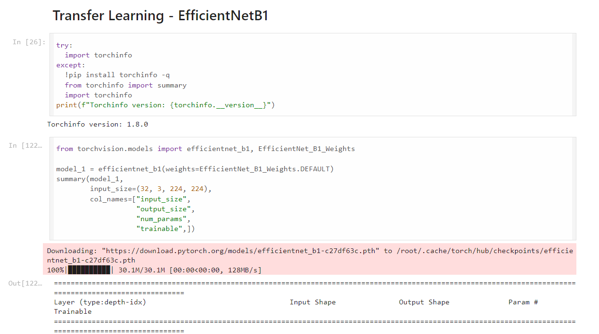
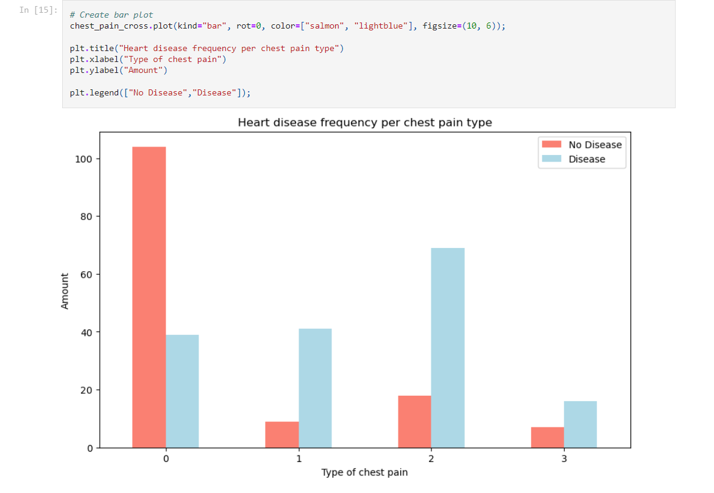
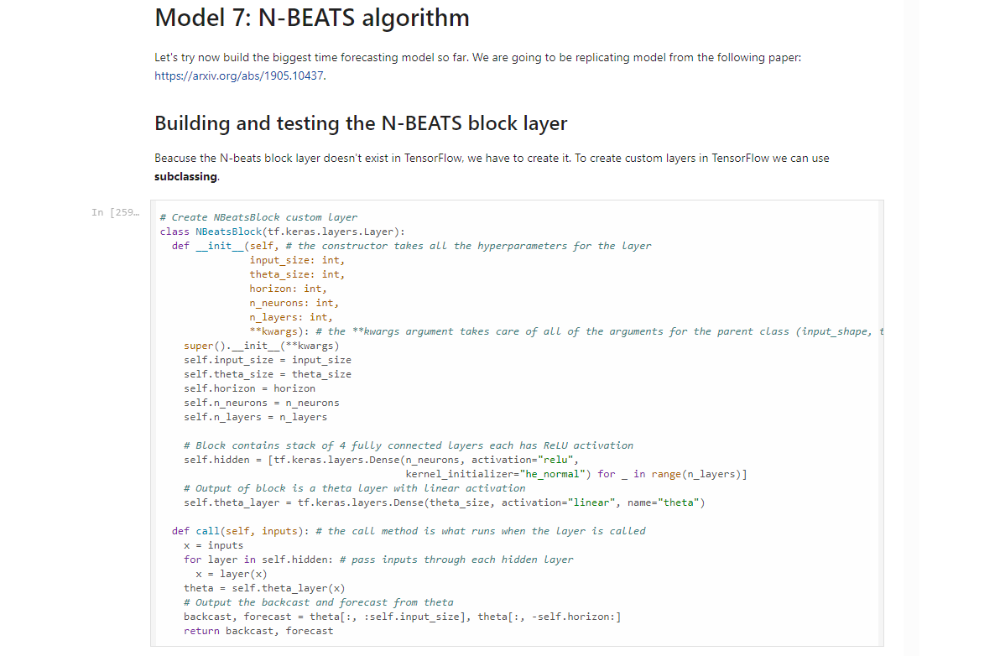
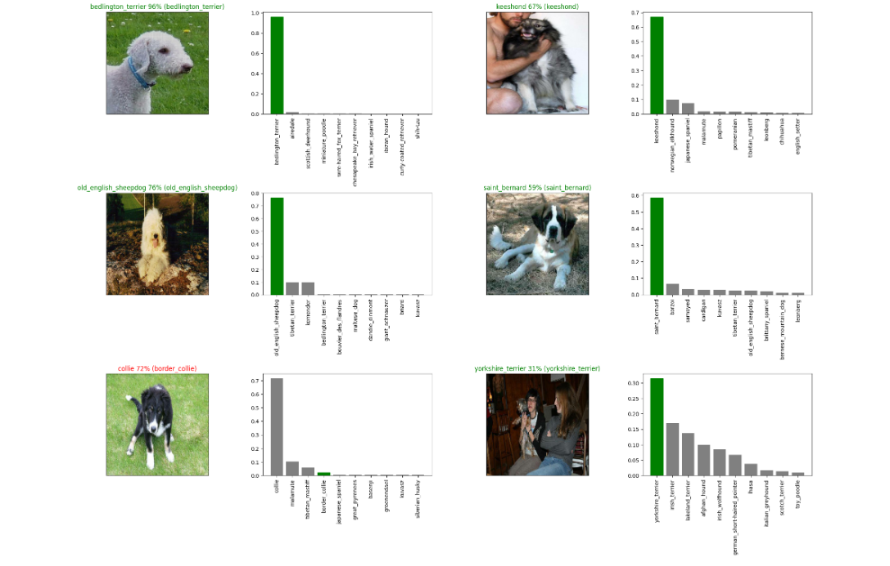
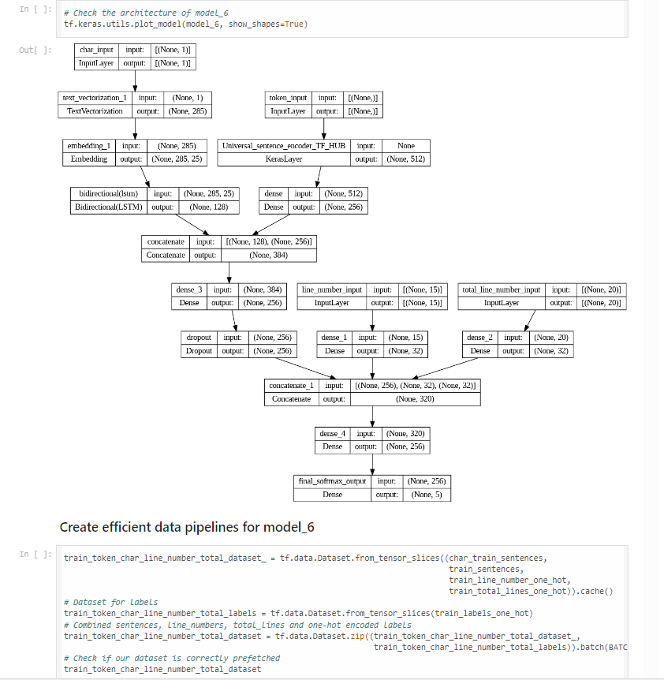

# Machine Learning

## Short description

This repository contains all my work related to Machine Learning. It includes several projects implemented with Sklearn, TensorFlow, and PyTorch, covering various domains such as computer vision, natural language processing, as well as simpler tasks like regression or classification with Sklearn.

The projects feature a wide range of visualization charts and graphs, primarily created using Matplotlib and Pandas. Additionally, Seaborn was utilized for some tables.

Feel free to explore the code and learn!
## Screenshots

**Transfer learning with PyTorch**

**Data visualization with matplotlib and pandas**

**Replicating model from the paper using TensorFlow**

**Model outputs visualization with matplotlib and pandas**

**Visualizing model architecture and creating data pipelines in TensorFlow**

